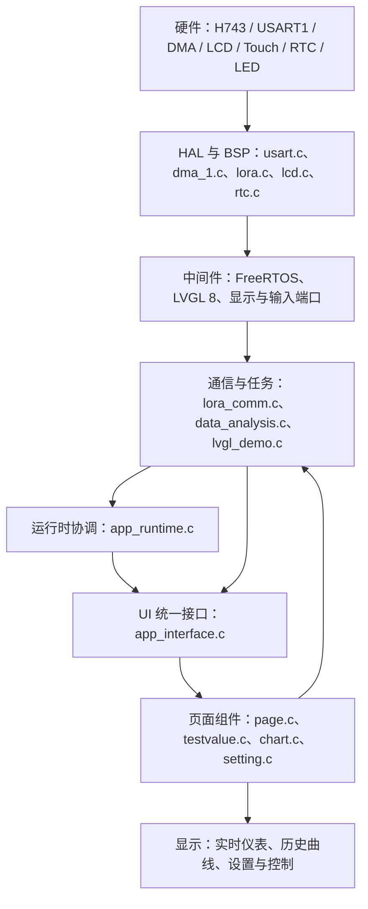
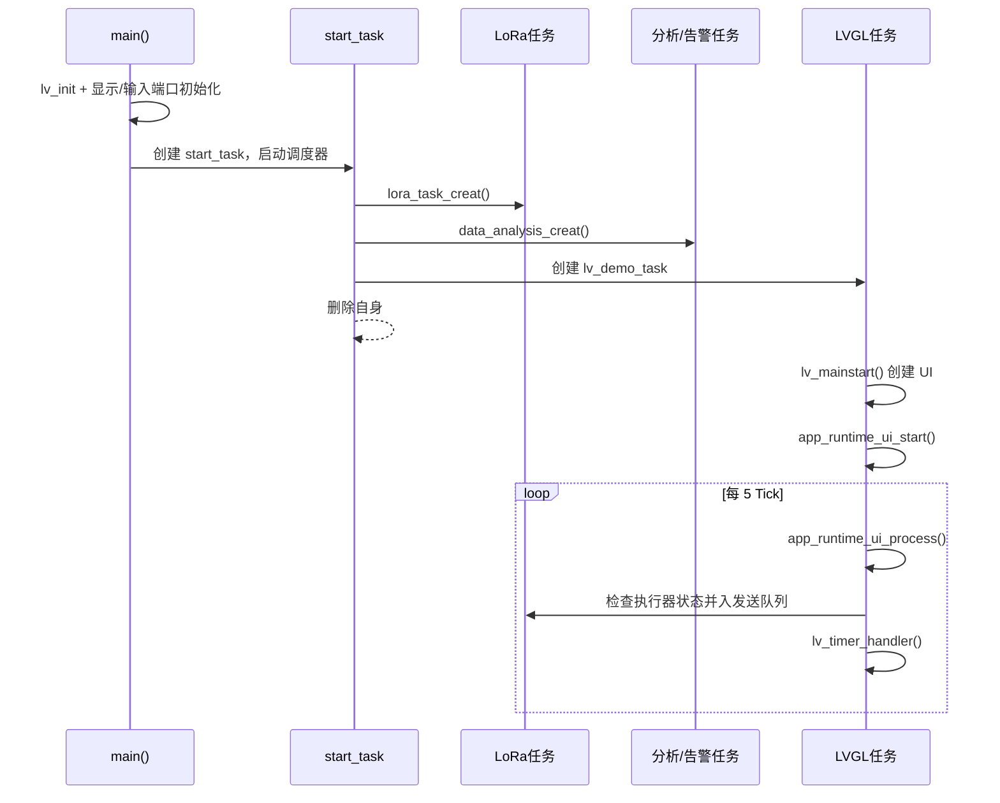

# STM32H743 环境监测终端工程架构与实现说明

> 本文依据当前工作区代码编写，目标工程为 [atk_h743.uvprojx](../Projects/MDK-ARM/atk_h743.uvprojx)。文档只说明现有实现，不代表所有预留传感器均已接入。

## 1. 工程目标与当前功能

本工程运行在 STM32H743IIT6（Cortex-M7）上，以 FreeRTOS 组织任务，以 LVGL 8 构建 800×480 环境监测界面，通过 USART1、DMA 和 LoRa 模块向传感器节点轮询数据。

当前代码已形成以下完整链路：

- CO、CO₂、温度、湿度：LoRa 轮询、接收、解析、保存和界面刷新。
- CO：额外保存 24 个采样值，并在数组装满后更新历史折线图。
- 六路气体仪表：CO、CO₂、O₂、H₂S、SO₂、NH₃ 共用统一的 UI 数据结构和危险度换算接口。
- RTC：读取日期时间并刷新 Settings 页面。
- 告警：根据六路仪表的危险百分比计算安全、预警和危险状态。
- 执行器：UI 开关或告警任务修改风扇、开窗状态，再经 LoRa 发送控制命令。

当前真实数据接入情况：

| 数据项 | 当前来源 | 当前处理 | 状态 |
|---|---|---|---|
| CO | LoRa 返回的 2 字节数据 | 原始值 ÷ 100，得到 ppm | 已接入 |
| CO₂ | LoRa 返回的 2 字节数据 | `400 + 原始值 × 80`，得到 ppm | 已接入，但换算是当前测试公式 |
| 温度 | LoRa 返回的 2 字节数据 | 原始值 ÷ 100，得到 ℃ | 已接入 |
| 湿度 | LoRa 返回的 2 字节数据 | 原始值 ÷ 100，得到 %RH | 已接入 |
| O₂ | `app_runtime.c` 中固定为 `21.0f` | 直接作为 `%vol` | 占位值，未接传感器 |
| H₂S、SO₂、NH₃ | `triangle` 当前固定为 0 | 计算结果均为 0 | 预留，未接传感器 |

## 2. 分层架构与链接



### 2.1 启动与硬件层

- [User/main.c](../User/main.c)：程序入口，完成 Cache、HAL、480 MHz 系统时钟、LoRa、MPU、LED、按键、SDRAM、RTC 和触摸校准初始化。
- [Drivers/SYSTEM/sys/sys.c](../Drivers/SYSTEM/sys/sys.c)：系统时钟、Cache 和底层系统配置。
- [Drivers/SYSTEM/delay/delay.c](../Drivers/SYSTEM/delay/delay.c)：启动阶段使用的延时接口。
- [Drivers/BSP/MPU/mpu.c](../Drivers/BSP/MPU/mpu.c)：配置 H743 内存区域属性。
- [Drivers/BSP/SDRAM/sdram.c](../Drivers/BSP/SDRAM/sdram.c)：初始化外部 SDRAM，为显示缓冲等大内存对象提供空间。
- [Drivers/BSP/LCD/lcd.c](../Drivers/BSP/LCD/lcd.c) 与 [ltdc.c](../Drivers/BSP/LCD/ltdc.c)：LCD 和 LTDC 显示驱动。
- [Drivers/BSP/TOUCH/touch.c](../Drivers/BSP/TOUCH/touch.c)：触摸输入与校准数据。
- [Drivers/BSP/RTC/rtc.c](../Drivers/BSP/RTC/rtc.c)：RTC 初始化、日期和时间读写。
- [Drivers/BSP/LED/led.c](../Drivers/BSP/LED/led.c)：板载告警 LED 控制。

核心启动代码位于 [main.c:35](../User/main.c#L35)：

```c
int main(void)
{
    sys_cache_enable();
    HAL_Init();
    sys_stm32_clock_init(192, 5, 2, 4);  /* 480 MHz */
    delay_init(480);
    lora_init(9600U);
    mpu_memory_protection();
    led_init();
    key_init();
    sdram_init();
    app_runtime_hardware_init();
    lvgl_demo();
}
```

### 2.2 LoRa 串口与 DMA 驱动层

- [Drivers/SYSTEM/usart/usart.c](../Drivers/SYSTEM/usart/usart.c)：USART1 初始化、空闲线 DMA 接收和 4 深度帧队列。
- [Drivers/BSP/DMA/dma_1.c](../Drivers/BSP/DMA/dma_1.c)：USART1_RX 对应 DMA1 Stream2。
- [Drivers/BSP/LORA/lora.c](../Drivers/BSP/LORA/lora.c)：LoRa 定点发送、数据包封装、CRC-16/CCITT-FALSE 校验和接收解析。
- [Drivers/BSP/LORA/lora.h](../Drivers/BSP/LORA/lora.h)：LoRa 帧常量、状态码和公共接口。

USART1 硬件对应关系见 [usart.h:37](../Drivers/SYSTEM/usart/usart.h#L37)：

| 功能 | 外设/引脚 | 参数 |
|---|---|---|
| LoRa TX | USART1_TX / PA9 | 9600 baud，8N1 |
| LoRa RX | USART1_RX / PA10 | USART1 空闲线 DMA |
| RX DMA | DMA1 Stream2 | `DMA_REQUEST_USART1_RX` |
| DMA 缓冲区 | `g_uart1_rx_dma_buffer` | 256 字节 |
| 接收帧队列 | `g_uart1_rx_frame_queue` | 4 帧 |

接收链路为：

1. `lora_init(9600)` 调用 `usart_init()`，随后启动 `HAL_UARTEx_ReceiveToIdle_DMA()`。
2. UART 空闲事件进入 [HAL_UARTEx_RxEventCallback()](../Drivers/SYSTEM/usart/usart.c#L306)。
3. 回调使 D-Cache 中对应区域失效，将本帧复制进 4 深度软件队列，然后重新启动 DMA。
4. 应用任务通过 `uart1_rx_frame_take()` 取出一帧。
5. `lora_receive_packet()` 搜索 `0x4C 0x52` 魔数，校验版本、类型、长度和 CRC。
6. `lora_receive_array()` 只接受二进制数组包，并向上层返回有效负载。

LoRa 数组包格式见 [lora.h:63](../Drivers/BSP/LORA/lora.h#L63)：

```text
[目标地址高][目标地址低][目标信道]
[0x4C][0x52][版本 0x01][类型 0x01]
[长度高][长度低][DATA...][CRC高][CRC低]
```

长度和传感器返回值均使用大端顺序；CRC 覆盖版本、类型、长度和数据区，不覆盖定点传输的地址、信道和两个魔数。

### 2.3 FreeRTOS 任务与应用调度层

- [User/lvgl_demo.c](../User/lvgl_demo.c)：初始化 LVGL，创建所有应用任务并启动调度器。
- [User/lora_comm.c](../User/lora_comm.c)：LoRa 发送队列、发送任务和传感器轮询任务。
- [User/data_analysis.c](../User/data_analysis.c)：数据分析任务和告警执行任务。
- [User/FreeRTOSConfig.h](../User/FreeRTOSConfig.h)：1 kHz RTOS Tick、46 KiB FreeRTOS Heap 等配置。

任务创建关系：



| 任务 | 优先级 | 栈大小 | 主要职责 |
|---|---:|---:|---|
| `start_task` | 1 | 128 | 创建其余任务后删除自身 |
| `lv_demo_task` | 3 | 1024 | 唯一的主 UI 循环，每 5 Tick 处理 LVGL |
| `lora_tx_task` | 4 | 256 | 阻塞等待发送队列，串行调用底层 LoRa 发送 |
| `sensor_polling_task` | 4 | 256 | 依次轮询 CO、CO₂、温度和湿度 |
| `analyze_task` | 4 | 128 | 每 1000 Tick 计算全局告警状态 |
| `alarm_task` | 5 | 128 | 每 1000 Tick 驱动 LED，并修改风扇/开窗状态 |

### 2.4 运行时协调层

[User/app_runtime.c](../User/app_runtime.c) 是硬件数据与 UI 之间的协调层，主要负责：

- 初始化 RTC，并只在 RTC 内容无效时写入默认时间。
- 每 1000 ms 读取 RTC、生成六路气体数组、换算温湿度并刷新 UI。
- 保存 CO 的 24 点历史数组。
- 根据六路仪表的危险百分比生成 `alarm_flag`。

该层不创建 LVGL 控件，只通过 [app_interface.h](../User/UI/app_interface.h) 暴露的统一接口更新界面。

### 2.5 UI 适配接口层

[User/UI/app_interface.c](../User/UI/app_interface.c) 把应用语义转换成具体 LVGL 控件操作，降低运行时与页面布局之间的耦合。

| 应用接口 | 写入的 UI 对象/状态 | 最终显示 |
|---|---|---|
| `app_interface_set_datetime()` | `g_setting_ui.date_label/time_label` | 日期、时间 |
| `app_interface_set_environment()` | 温度/湿度 Label | `Temp: x.x C`、`Humidity: x.x %RH` |
| `app_interface_set_gas_value()` | `g_test_array[sensor]` | 实测值、危险百分比、颜色 |
| `app_interface_set_history()` | `g_chart_array[sensor]` | 对应气体的 24 点曲线 |
| `app_interface_set_sensor_connected()` | `g_app_state_flags` 和状态 LED | 绿灯连接、红灯断开 |
| `app_interface_set_fan_enabled()` | 风扇标志、Switch 和文字 | ON/OFF |
| `app_interface_set_window_open()` | 开窗标志、Switch 和文字 | OPEN/CLOSED |

状态位定义于 [app_interface.h:35](../User/UI/app_interface.h#L35)。位 0～5 对应六路传感器，位 6 对应风扇，位 7 对应开窗舵机。

### 2.6 UI 页面与组件层

- [User/UI/ui.c](../User/UI/ui.c)：UI 总入口；STM32 工程关闭模拟定时器。
- [User/UI/page.c](../User/UI/page.c)：创建 `CurrentValues`、`PastValues`、`Settings` 三个页面，并建立六路气体对象的一致顺序。
- [User/UI/testvalue.c](../User/UI/testvalue.c)：单个气体仪表、阈值模型、危险百分比和蓝/黄/红颜色。
- [User/UI/chart.c](../User/UI/chart.c)：24 点历史图、阈值虚线、分段着色和小数缩放。
- [User/UI/setting.c](../User/UI/setting.c)：RTC、连接 LED、温湿度、风扇和开窗控件。
- [Middlewares/LVGL/GUI_APP/lv_mainstart.c](../Middlewares/LVGL/GUI_APP/lv_mainstart.c)：从官方示例入口转到 `ui_init()`。
- [Middlewares/LVGL/GUI/lvgl/lv_conf.h](../Middlewares/LVGL/GUI/lvgl/lv_conf.h)：LVGL 配置，当前颜色深度为 16 bit。

三个页面的职责：

| 页面 | 创建位置 | 数据对象 | 数据更新入口 |
|---|---|---|---|
| CurrentValues | `page.c` | `g_test_array[6]` | `app_interface_set_gas_value()` |
| PastValues | `page.c` | `g_chart_array[6]` | `app_interface_set_history()` |
| Settings | `setting.c` | `g_setting_ui` | 日期、环境、连接和控制接口 |

## 3. 六路气体的一致下标关系

六路气体必须始终使用 [app_sensor_id_t](../User/UI/app_interface.h#L22) 的固定顺序。该顺序同时用于仪表数组、历史图数组、连接状态位和 Settings LED：

| 下标 | 枚举 | 气体 | 实时仪表 | 历史图 | 连接标志 |
|---:|---|---|---|---|---|
| 0 | `APP_SENSOR_CO` | CO | `g_test_array[0]` | `g_chart_array[0]` | bit 0 |
| 1 | `APP_SENSOR_CO2` | CO₂ | `g_test_array[1]` | `g_chart_array[1]` | bit 1 |
| 2 | `APP_SENSOR_O2` | O₂ | `g_test_array[2]` | `g_chart_array[2]` | bit 2 |
| 3 | `APP_SENSOR_H2S` | H₂S | `g_test_array[3]` | `g_chart_array[3]` | bit 3 |
| 4 | `APP_SENSOR_SO2` | SO₂ | `g_test_array[4]` | `g_chart_array[4]` | bit 4 |
| 5 | `APP_SENSOR_NH3` | NH₃ | `g_test_array[5]` | `g_chart_array[5]` | bit 5 |

增加或交换传感器时，不能只修改页面文字；上述数组、枚举和状态映射必须同步，否则会出现“CO 数据显示在另一个气体仪表上”的错位问题。

## 4. 传感器采集实现逻辑

### 4.1 轮询命令与节点对应关系

轮询逻辑位于 [sensor_polling_task()](../User/lora_comm.c#L136)，每一路先发送一个 1 字节命令，再在最长 1000 ms 内非阻塞地检查接收队列，轮询之间延时 500 Tick。

| 数据项 | 命令值 | 目标地址 | 信道 | 返回长度 | 保存变量 |
|---|---:|---:|---:|---:|---|
| CO | `CO = 8` | `0x0004` | `0x16` | 2 字节 | `co_value_test` |
| CO₂ | `TEST_DATA = 1` | `0x0001` | `0x13` | 2 字节 | `co2_value_test` |
| 温度 | `DHT11_TEMPERATURE = 6` | `0x0001` | `0x13` | 2 字节 | `temperature_value_test` |
| 湿度 | `DHT11_HUMIDITY = 7` | `0x0001` | `0x13` | 2 字节 | `humidity_value_test` |

四个全局采集变量在 [lora_comm.c:3](../User/lora_comm.c#L3) 定义，在 [lora_comm.h:27](../User/lora_comm.h#L27) 使用 `extern` 声明：

```c
volatile uint16_t co_value_test = 0;
volatile uint16_t co2_value_test = 0;
volatile uint16_t temperature_value_test = 0;
volatile uint16_t humidity_value_test = 0;
```

2 字节数据按大端合成 16 位整数：

```c
value = ((uint16_t)rx[0] << 8) | rx[1];
```

因此发送节点若要传输 `23.56`，采用“放大 100 倍”的协议时应发送整数 `2356`，即高字节 `0x09`、低字节 `0x34`。

### 4.2 原始值到显示值的换算

换算位于 [app_runtime.c:110](../User/app_runtime.c#L110)：

```c
gas_values[APP_SENSOR_CO] = co_value_test * 0.01f;
gas_values[APP_SENSOR_CO2] = 400.0f + co2_value_test * 80.0f;
app_interface_set_environment(temperature_value_test * 0.01f,
                              humidity_value_test * 0.01f);
```

对应公式为：

```text
CO(ppm)       = CO原始整数 / 100
温度(℃)       = 温度原始整数 / 100
湿度(%RH)     = 湿度原始整数 / 100
CO₂(ppm)      = 400 + CO₂原始整数 × 80
```

CO₂ 当前没有使用“除以 100”协议，而是测试映射公式。发送端数据含义必须与该公式一致；如果 CO₂ 节点未来也发送放大 100 倍的 ppm 值，则 H743 端应改为除以 100，不能继续使用当前公式。

### 4.3 连接状态

CO 和 CO₂ 成功收到 LoRa 包后分别置连接状态为 `true`；等待期间任何一次非成功结果都会暂时置为 `false`。温度和湿度没有独立连接状态位，它们属于环境卡片数据。O₂、H₂S、SO₂、NH₃ 当前启动时保持断开。

Settings 页 LED 仅表示通信/传感器连接状态：绿色为连接，红色为断开；它不表示浓度是否安全。

## 5. CO 24 点历史数组逻辑

CO 历史数组和状态全部封装在 [app_runtime.c:24](../User/app_runtime.c#L24)：

```c
static float s_co_history[APP_HISTORY_HOURS] = {0.0f};
static uint8_t s_co_history_index;
static uint8_t s_co_history_count;
static uint8_t s_co_history_dirty;
```

每次 CO 成功解析后，[lora_comm.c:160](../User/lora_comm.c#L160) 先除以 100，再记录：

```c
app_runtime_record_co_sample((float)co_value_test / 100.0f);
```

[app_runtime_record_co_sample()](../User/app_runtime.c#L40) 的当前策略为：

1. 前 24 次采集依次写入下标 0～23。
2. 数组装满后，下标固定为 23。
3. 后续每次新数据只覆盖 `s_co_history[23]`，下标 0～22 保持不变。
4. 写数组时进入 FreeRTOS 临界区，避免 UI 任务复制数组时读到半更新状态。
5. 只有 `count == 24` 且数据有变化时，UI 任务才复制快照并调用 `app_interface_set_history(APP_SENSOR_CO, ...)`。

因此这个数组目前表示“最初 23 个采样 + 最新一个采样”，并不是滚动窗口，也不是严格的每小时一个点。若采集任务每轮约 6 秒完成一次，装满 24 点只需约几分钟；`00`～`23` 目前只是图表下标标签。

## 6. 实际浓度到危险百分比的转换

仪表中央的 `%` 是危险程度百分比，不是浓度单位；实际浓度显示在圆弧下方。转换实现在 [testvalue.c](../User/UI/testvalue.c)，阈值配置在 [page.c:74](../User/UI/page.c#L74)。

### 6.1 单边升高模型

CO、CO₂、H₂S、SO₂、NH₃ 使用 `TESTVALUE_THRESHOLD_HIGH`：

- 测量值从量程下限到正常上限，映射为危险度 0%～33%，蓝色。
- 从正常上限到报警边界，映射为 33%～66%，黄色。
- 从报警边界到量程上限，映射为 66%～100%，红色。
- 超过图表量程后，百分比钳位到 100%。

当前阈值：

| 气体 | 正常上限 | 报警边界 | 图表上限 | 报警边界是否包含 |
|---|---:|---:|---:|---|
| CO | 10 ppm | 35 ppm | 100 ppm | 是 |
| CO₂ | 1000 ppm | 5000 ppm | 5000 ppm | 是 |
| H₂S | 1 ppm | 10 ppm | 20 ppm | 否 |
| SO₂ | 0.5 ppm | 2 ppm | 10 ppm | 是 |
| NH₃ | 5 ppm | 25 ppm | 100 ppm | 是 |

### 6.2 O₂ 双边偏离模型

O₂ 过低和过高都危险，因此使用 `TESTVALUE_THRESHOLD_BAND`：

| 区间 | 状态 | 危险度 |
|---|---|---|
| 20.5～21.5 %vol | 正常，蓝色 | 从中心 21.0 向两边映射 0%～33% |
| 19.5～20.5 或 21.5～23.5 %vol | 预警，黄色 | 33%～66% |
| 低于 19.5 或高于 23.5 %vol | 报警，红色 | 66%～100% |

O₂ 图表量程为 15～25 %vol。当前运行时固定输入 `21.0f`，因此它代表正常中心值、危险度约 0%，并非实际氧气传感器采集值。

### 6.3 仪表和历史图共用阈值

`g_chart_array[i].thresholds` 指向对应的 `g_test_array[i]`。因此实时仪表与历史曲线共用同一组阈值：

- 仪表圆弧按等级显示蓝、黄、红。
- 历史折线的每一段取相邻两点中更危险的等级着色。
- 单边模型绘制正常上限和报警边界两条虚线。
- O₂ 双边模型绘制四条阈值虚线。
- 图表上限不超过 25 时内部放大 10 倍传给 LVGL Chart，以保留一位小数。

## 7. 告警与执行器实现逻辑

### 7.1 告警状态生成

[app_runtime_analyze()](../User/app_runtime.c#L177) 每秒读取六个 `g_test_array[i].test_value`：

- 任意一路危险度达到约 65%，`alarm_flag = ALARM_FANG_DANGLE`。
- 所有气体危险度都低于约 40%，`alarm_flag = ALARM_FANG_SAFE`。
- 其余情况为 `ALARM_FANG_WORN`。

`alarm_flag` 在 [app_runtime.c:29](../User/app_runtime.c#L29) 定义，在 [app_runtime.h:6](../User/app_runtime.h#L6) 通过 `extern` 暴露。

### 7.2 告警动作

[alarm_task()](../User/data_analysis.c#L48) 的当前动作：

| 告警状态 | LED | 风扇状态 | 开窗状态 |
|---|---|---|---|
| 危险 | LED0/LED1 固定组合 | 打开 | 打开 |
| 预警 | LED1 翻转 | 保持现状 | 打开 |
| 安全 | LED 固定组合 | 保持现状 | 保持现状 |

代码中安全/预警状态下关闭风扇和关窗的语句目前被注释，因此系统不会在恢复安全后自动复位执行器。

### 7.3 UI 状态到 LoRa 命令

Settings 页 Switch 的事件回调只修改 `g_app_state_flags`。LVGL 任务中的 [fan_sensor_status_read()](../User/lvgl_demo.c#L98) 检查状态变化并将命令放入 LoRa 发送队列：

| 控制项 | 关闭命令 | 打开命令 | 目标地址 | 信道 |
|---|---:|---:|---:|---:|
| 风扇 | `FAN_OFF = 2` | `FAN_ON = 3` | `0x0004` | `0x16` |
| 开窗舵机 | `SENSER_OFF = 4` | `SENSER_ON = 5` | `0x0004` | `0x16` |

只有命令成功进入队列后才更新“上一次发送状态”，避免队列满时错误地认为控制命令已经提交。实际串口发送由单独的 `lora_tx_task` 串行完成。

## 8. 关键全局对象与所有权

| 对象 | 定义位置 | 主要写入者 | 主要读取者 | 含义 |
|---|---|---|---|---|
| `co_value_test` | `lora_comm.c` | 轮询任务 | 运行时 UI 刷新 | CO 原始整数 |
| `co2_value_test` | `lora_comm.c` | 轮询任务 | 运行时 UI 刷新 | CO₂ 原始整数 |
| `temperature_value_test` | `lora_comm.c` | 轮询任务 | 运行时 UI 刷新 | 温度 ×100 |
| `humidity_value_test` | `lora_comm.c` | 轮询任务 | 运行时 UI 刷新 | 湿度 ×100 |
| `g_test_array[6]` | `page.c` | UI 接口 | 图表、分析任务 | 六路实时仪表及阈值 |
| `g_chart_array[6]` | `page.c` | UI 接口 | LVGL 绘制 | 六路 24 点历史图 |
| `g_setting_ui` | `setting.c` | UI 创建/接口 | LVGL | Settings 页控件指针 |
| `g_app_state_flags` | `app_interface.c` | UI、告警、连接逻辑 | UI、LoRa 控制 | 连接与执行器位图 |
| `alarm_flag` | `app_runtime.c` | 分析任务 | 告警任务 | 安全/预警/危险状态 |
| `s_co_history[24]` | `app_runtime.c` | CO 轮询任务 | LVGL 任务 | CO 历史采样数组 |

`volatile` 只阻止编译器省略访问，不提供任务间原子性或完整同步。CO 历史数组已经用临界区保护；其他共享对象的并发访问仍应遵守下节约束。

<!-- ## 9. 当前实现的重要约束与注意事项

1. **LVGL 线程约束**：LVGL 不是线程安全的。设计目标是所有控件更新都在 `lv_demo_task` 中执行，但当前 `sensor_polling_task` 会直接调用 `app_interface_set_sensor_connected()`，`alarm_task` 也会调用执行器 UI 接口。这些接口会操作 LVGL 对象，存在跨任务访问风险。后续稳健方案应让非 UI 任务只更新共享快照或发送消息，由 LVGL 任务统一刷新控件。
2. **O₂ 目前不是采集值**：当前工作区在 `app_runtime.c` 固定写入 `21.0f`。若要接入真实 O₂，必须新增接收变量、轮询命令、连接状态和单位换算。
3. **CO 历史不是滚动 24 小时**：数组满后只覆盖下标 23，也没有按 RTC 小时采样。若目标是过去 24 小时，应按小时写入或实现环形缓冲区。
4. **连接判定较敏感**：CO/CO₂ 在 1 秒等待窗口内，任何一次 `LORA_NO_DATA` 都会先显示断开，即使稍后在同一窗口收到数据。这可能造成状态 LED 频繁闪烁。
5. **温湿度无有效性标志**：超时后保留旧值，界面无法区分“最新采集成功”和“显示上一次数据”。
6. **报警读取 UI 模型**：分析任务直接读取 `g_test_array[].test_value`，这使业务报警逻辑依赖 UI 数据结构。更清晰的架构是运行时先生成独立数据模型，再分别提供给报警与 UI。
7. **安全状态不会自动关执行器**：相应代码已注释，属于当前行为，不是 LoRa 发送故障。
8. **源码注释编码**：部分源文件的中文注释在某些终端显示为乱码，建议统一保存为 UTF-8 或明确使用 GBK；修改编码前应先备份并全量编译。 -->

## 9. 编译、输出与阅读顺序

Keil 工程配置：

| 项目 | 当前值 |
|---|---|
| Target | `LVGL` |
| Device | `STM32H743IITx` |
| 内核 | Cortex-M7，双精度 FPU |
| 宏 | `USE_HAL_DRIVER, STM32H743xx` |
| 输出目录 | `Output` |
| 输出名称 | `atk_h743` |
| HEX | 已启用 |

推荐按照以下顺序阅读代码：

1. [main.c](../User/main.c)：了解硬件初始化顺序。
2. [lvgl_demo.c](../User/lvgl_demo.c)：了解任务创建和主循环。
3. [lora_comm.c](../User/lora_comm.c)：了解轮询命令和原始数据来源。
4. [usart.c](../Drivers/SYSTEM/usart/usart.c) → [lora.c](../Drivers/BSP/LORA/lora.c)：了解 DMA 入帧和协议解析。
5. [app_runtime.c](../User/app_runtime.c)：了解单位换算、刷新周期、历史和告警。
6. [app_interface.c](../User/UI/app_interface.c)：了解业务数据如何映射到 UI。
7. [page.c](../User/UI/page.c) → [testvalue.c](../User/UI/testvalue.c) → [chart.c](../User/UI/chart.c) → [setting.c](../User/UI/setting.c)：了解页面、阈值、曲线和设置控件。

## 10. 一条 CO 数据的完整例子

假设 CO 节点测得 `12.34 ppm`：

1. 发送节点将其放大 100 倍为整数 `1234`，返回两字节 `0x04 0xD2`。
2. H743 的 USART1 空闲线 DMA 收到 LoRa 数组包，回调将整帧放入接收队列。
3. `lora_receive_array()` 校验包头、类型、长度和 CRC，得到两个有效字节。
4. 轮询任务计算 `co_value_test = (0x04 << 8) | 0xD2 = 1234`。
5. 历史保存先执行 `1234 / 100 = 12.34 ppm`，写入 `s_co_history`。
6. UI 每秒执行 `co_value_test * 0.01 = 12.34 ppm`。
7. CO 正常上限为 10 ppm、报警边界为 35 ppm，因此 12.34 处于预警段，危险度从 33% 向 66% 线性增加。
8. CurrentValues 页显示 `CO(ppm): 12.34`，中央显示对应危险百分比，圆弧为黄色。
9. 当历史数组达到 24 个样本后，PastValues 页的 CO 曲线被整体刷新。
10. 若危险百分比未达到约 65%，全局报警不会进入危险状态；它可能处于预警状态，具体取决于其他五路气体。

这条链路可概括为：

```text
CO 传感器
→ LoRa 节点放大 100 倍
→ USART1 空闲线 DMA
→ LoRa CRC/数组包解析
→ co_value_test
→ app_runtime 除以 100
→ app_interface
→ g_test_array[APP_SENSOR_CO]
→ 实时仪表 / 危险分析 / CO 历史图
```
